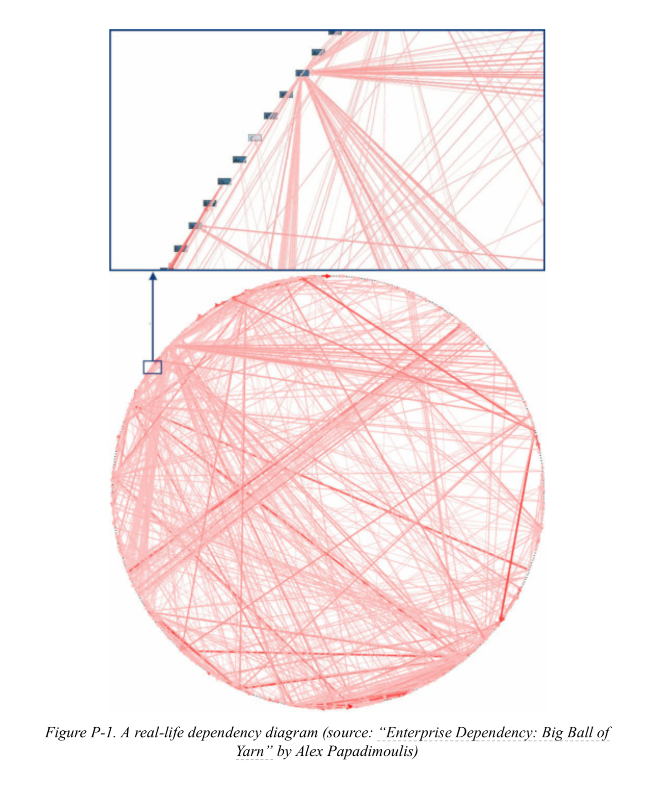
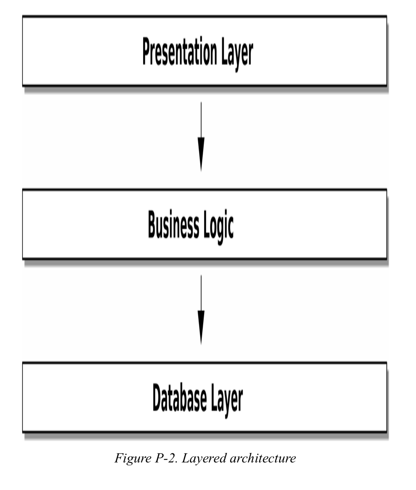
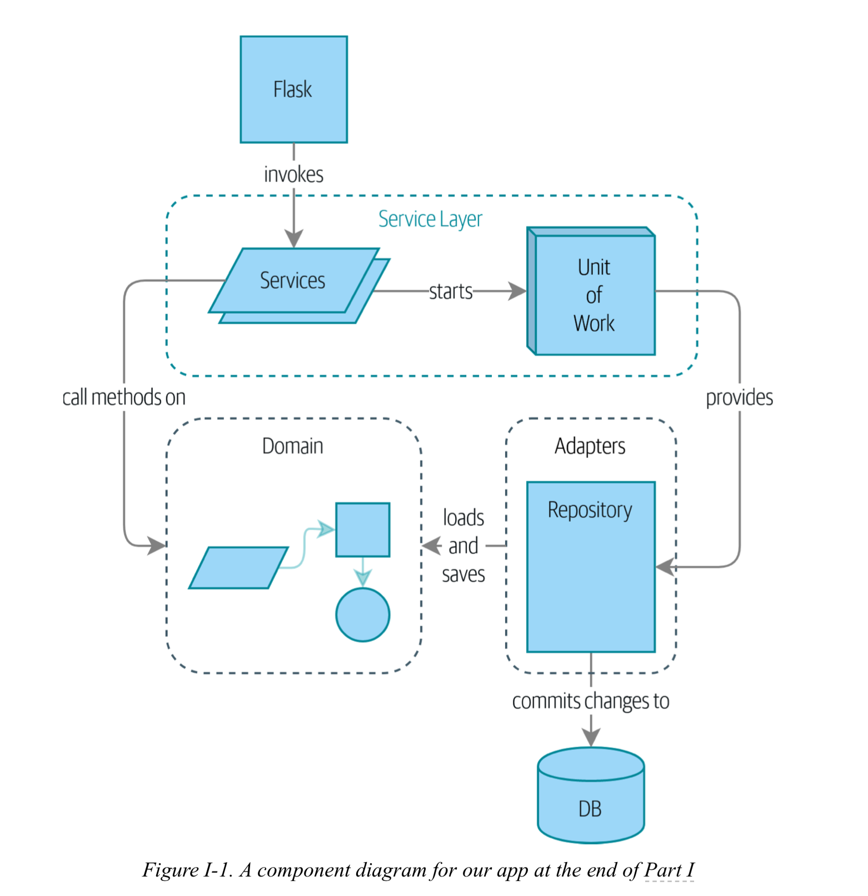
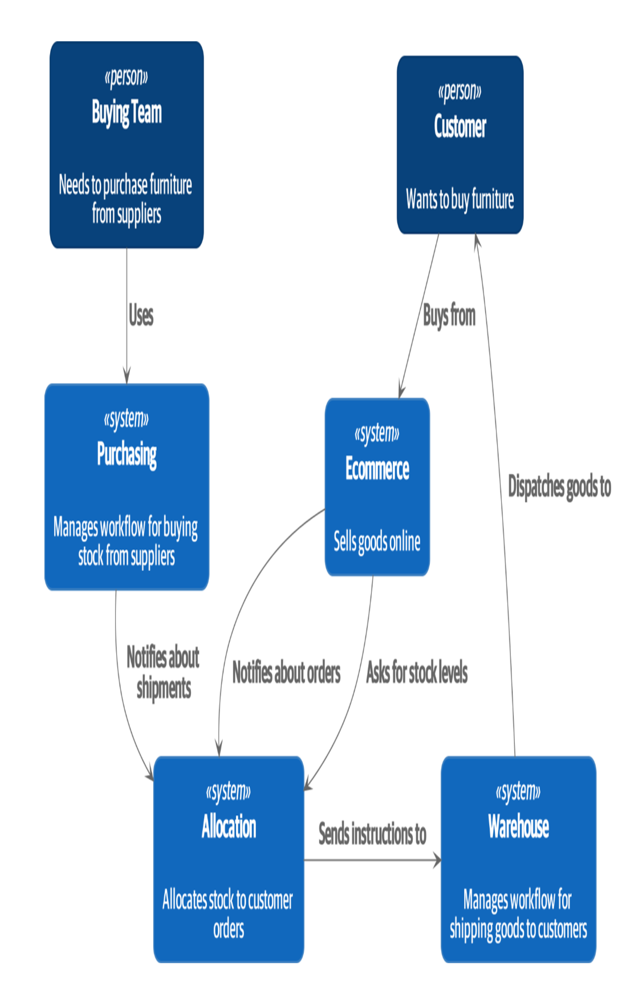

# + Architecture Patterns
- Building Architecture For Event-driven, DDD, TDD, BDD Microservices.

+ defining chaos for software engineer :
This is so common that software engineers have their own term for chaos: the Big Ball of Mud anti-pattern.

++ All problems in computer science can be solved by adding another level of indirection.

Generally it means that by increasing the level of abstraction one can make the problem easier to understand/resolve.
Be careful with your abstractions though, the full quote at least as I heard it is, "You can solve every problem with another level of indirection,
except for the problem of too many levels of indirection".

    + Encapsulation and Abstractions :
    - The term encapsulation covers two closely related ideas: simplifying behavior and hiding data. In this discussion,
      we’re using the first sense. We encapsulate behavior by identifying a task that needs to be done in our code and
      giving that task to a well-defined object or function. We call that object or function an abstraction.

    import requests
    params = dict(q='Sausages', format='json')
    parsed = requests.get('http://api.duckduckgo.com/',
    params=params).json()
    results = parsed['RelatedTopics'] for r in results:
    if 'Text' in r:
    print(r['FirstURL'] + ' - ' + r['Text'])

    --------------------------------------------------------------------

    import duckduckgo
    for r in duckduckgo.query('Sausages').results:
    print(r.url + ' - ' + r.text)

    ++ this two examples do the same thing but the second one use a higher level of abstration and encapsulation.

    - Encapsulating behavior by using abstractions is a powerful tool for making code more expressive, more testable, and easier to maintain.

    NOTE : In the literature of the object-oriented (OO) world, one of the classic characterizations of this approach is called responsibility-driven design;
           it uses the words roles and responsibilities rather than tasks. The main point is to think about code in terms of behavior, rather than in terms of data or algorithms.

    Layering
    Encapsulation and abstraction help us by hiding details and protecting the consistency of our data, but we also need to pay attention to the interactions between
    our objects and functions. When one function, module, or object uses another, we say that the one depends on the other. These dependencies form a kind of network or graph.

    ++ Changing one node of the graph becomes difficult because it has the potential to affect many other parts of the system.

    - Layered architectures are one way of tackling this problem. In a layered architecture, we divide our code into discrete categories or roles, and we introduce rules about which
      categories of code can call each other.

    - One of the most common examples is the three-layered architecture shown in Figure :

    Layered architecture is perhaps the most common pattern for building business software. In this model we have user-interface components, which could be a web page, an API,
    or a command line; these user- interface components communicate with a business logic layer that contains our business rules and our workflows; and finally, we have a database
    layer that’s responsible for storing and retrieving data.

    - The Dependency Inversion Principle
    You might be familiar with the dependency inversion principle (DIP) already, because it’s the D in SOLID.2

    In the meantime, we can talk about DIP’s formal definition:

    1. High-level modules should not depend on low-level modules. Both should depend on abstractions.
    2. Abstractions should not depend on details. Instead, details should depend on abstractions.

    ++ High-level modules are the code that your organization really cares about. Perhaps you work for a pharmaceutical company, and your high-level modules deal with patients and trials.
       Perhaps you work for a bank, and your high-level modules manage trades and exchanges. The high-level modules of a software system are the functions, classes, and packages that deal
       with our real-world concepts.

    ++ By contrast, low-level modules are the code that your organization doesn’t care about. It’s unlikely that your HR department gets excited about filesystems or network sockets.
       It’s not often that you discuss SMTP, HTTP, or AMQP with your finance team. For our nontechnical stakeholders, these low-level concepts aren’t interesting or relevant. All they
       care about is whether the high-level concepts work correctly. If payroll runs on time, your business is unlikely to care whether that’s a cron job or a transient function running
       on Kubernetes.

    So the first part of the DIP says that our business code shouldn’t depend on technical details; instead, both should use abstractions.

    + business logic :
    One of the most common reasons that our designs go wrong is that business logic becomes spread throughout the layers of our application, making it hard to identify, understand, and change.

    1- Part I. Building an Architecture to Support Domain Modeling :

    We’ve found that many developers, when asked to design a new system, will immediately start to build a database schema, with the object model treated as an afterthought. This is where it all starts to go wrong.
    Instead, behavior should come first and drive our storage requirements. After all, our customers don’t care about the data model. They care about what the system does; otherwise they’d just use a spreadsheet.

    - in this section, We show how to build persistence-ignorant code and how to create stable APIs around our domain so that we can refactor aggressively.

    To do that, we present four key design patterns:
    1- The Repository pattern, an abstraction over the idea of persistent storage
    2- The Service Layer pattern to clearly define where our use cases begin and end
    3- The Unit of Work pattern to provide atomic operations.
    4- The Aggregate pattern to enforce the integrity of our data

    Chapter 1. Domain Modeling :

    What Is a Domain Model?

    - Domain model is the business logic of your system.
    + The domain is a fancy way of saying the problem you’re trying to solve.
    + A model is a map of a process or phenomenon that captures a useful property.

    - The domain model is the mental map that business owners have of their businesses. All business people have these mental maps— they’re how humans think about complex processes.
    - DDD purpose : When we hear our business stakeholders using unfamiliar words, or using terms in a specific way, we should listen to understand the deeper meaning and encode their hard-won experience into our software.

    + Case study :

    We’re going to use a real-world domain model throughout this book, specifically a model from our current employment. MADE.com is a successful furniture retailer. We source our furniture from manufacturers all over the world and
    sell it across Europe.

    When you buy a sofa or a coffee table, we have to figure out how best to get your goods from Poland or China or Vietnam and into your living room.
    At a high level, we have separate systems that are responsible for buying stock, selling stock to customers, and shipping goods to customers. A system in the middle needs to coordinate the process by allocating stock
    to a customer’s orders;

    For the purposes of this book, we’re imagining that the business decides to implement an exciting new way of allocating stock. Until now, the business has been presenting stock and lead times based on what is physically
    available in the warehouse. If and when the warehouse runs out, a product is listed as “out of stock” until the next shipment arrives from the manufacturer.

    - business optimization : Here’s the innovation: if we have a system that can keep track of all our shipments and when they’re due to arrive, we can treat the goods on those ships as real stock and part of our inventory,
                            just with slightly longer lead times. Fewer goods will appear to be out of stock, we’ll sell more, and the business can save money by keeping lower inventory in the domestic warehouse.

    - business problem : But allocating orders is no longer a trivial matter of decrementing a single quantity in the warehouse system. We need a more complex allocation mechanism. Time for some domain modeling.

    + “Some Notes on Allocation” shows some notes we might have taken while having a conversation with our domain experts about allocation.

    SOME NOTES ON ALLOCATION
    A product is identified by a SKU, pronounced “skew,” which is short for stock-keeping unit. Customers place orders. An order is identified by an order reference and comprises multiple order lines, where each line has a SKU and a quantity. For example:
        10 units of RED-CHAIR
        1 unit of TASTELESS-LAMP
    The purchasing department orders small batches of stock. A batch of stock has a unique ID called a reference, a SKU, and a quantity.
    We need to allocate order lines to batches. When we’ve allocated an order line to a batch, we will send stock from that specific batch to the customer’s delivery address. When we allocate x units of stock to a batch, the available quantity is reduced by x. For example:
        We have a batch of 20 SMALL-TABLE, and we allocate an order line for 2 SMALL-TABLE. The batch should have 18 SMALL-TABLE remaining.
        We can’t allocate to a batch if the available quantity is less than the quantity of the order line. For example:
    We have a batch of 1 BLUE-CUSHION, and an order line for 2 BLUE-CUSHION. We should not be able to allocate the line to the batch.
    We can’t allocate the same line twice. For example:
        We have a batch of 10 BLUE-VASE, and we allocate an order line for 2 BLUE-VASE.
        If we allocate the order line again to the same batch, the batch should still have an available quantity of 8.
    Batches have an ETA if they are currently shipping, or they may be in warehouse stock. We allocate to warehouse stock in preference to shipment batches. We allocate to shipment batches in order of which has the earliest ETA.

