# + Architecture Patterns
- Building Architecture For Event-driven, DDD, TDD, BDD Microservices.

+ defining chaos for software engineer :
This is so common that software engineers have their own term for chaos: the Big Ball of Mud anti-pattern.

++ All problems in computer science can be solved by adding another level of indirection.

Generally it means that by increasing the level of abstraction one can make the problem easier to understand/resolve.
Be careful with your abstractions though, the full quote at least as I heard it is, "You can solve every problem with another level of indirection,
except for the problem of too many levels of indirection".

    + Encapsulation and Abstractions :
    - The term encapsulation covers two closely related ideas: simplifying behavior and hiding data. In this discussion,
      we’re using the first sense. We encapsulate behavior by identifying a task that needs to be done in our code and
      giving that task to a well-defined object or function. We call that object or function an abstraction.

    import requests
    params = dict(q='Sausages', format='json')
    parsed = requests.get('http://api.duckduckgo.com/',
    params=params).json()
    results = parsed['RelatedTopics'] for r in results:
    if 'Text' in r:
    print(r['FirstURL'] + ' - ' + r['Text'])

    --------------------------------------------------------------------

    import duckduckgo
    for r in duckduckgo.query('Sausages').results:
    print(r.url + ' - ' + r.text)

    ++ this two examples do the same thing but the second one use a higher level of abstration and encapsulation.

    - Encapsulating behavior by using abstractions is a powerful tool for making code more expressive, more testable, and easier to maintain.

    NOTE : In the literature of the object-oriented (OO) world, one of the classic characterizations of this approach is called responsibility-driven design;
           it uses the words roles and responsibilities rather than tasks. The main point is to think about code in terms of behavior, rather than in terms of data or algorithms.

    Layering
    Encapsulation and abstraction help us by hiding details and protecting the consistency of our data, but we also need to pay attention to the interactions between
    our objects and functions. When one function, module, or object uses another, we say that the one depends on the other. These dependencies form a kind of network or graph.

    ++ Changing one node of the graph becomes difficult because it has the potential to affect many other parts of the system.

    - Layered architectures are one way of tackling this problem. In a layered architecture, we divide our code into discrete categories or roles, and we introduce rules about which
      categories of code can call each other.

    - One of the most common examples is the three-layered architecture shown in Figure :

    Layered architecture is perhaps the most common pattern for building business software. In this model we have user-interface components, which could be a web page, an API,
    or a command line; these user- interface components communicate with a business logic layer that contains our business rules and our workflows; and finally, we have a database
    layer that’s responsible for storing and retrieving data.

    - The Dependency Inversion Principle
    You might be familiar with the dependency inversion principle (DIP) already, because it’s the D in SOLID.2

    In the meantime, we can talk about DIP’s formal definition:

    1. High-level modules should not depend on low-level modules. Both should depend on abstractions.
    2. Abstractions should not depend on details. Instead, details should depend on abstractions.

    ++ High-level modules are the code that your organization really cares about. Perhaps you work for a pharmaceutical company, and your high-level modules deal with patients and trials.
       Perhaps you work for a bank, and your high-level modules manage trades and exchanges. The high-level modules of a software system are the functions, classes, and packages that deal
       with our real-world concepts.

    ++ By contrast, low-level modules are the code that your organization doesn’t care about. It’s unlikely that your HR department gets excited about filesystems or network sockets.
       It’s not often that you discuss SMTP, HTTP, or AMQP with your finance team. For our nontechnical stakeholders, these low-level concepts aren’t interesting or relevant. All they
       care about is whether the high-level concepts work correctly. If payroll runs on time, your business is unlikely to care whether that’s a cron job or a transient function running
       on Kubernetes.

    So the first part of the DIP says that our business code shouldn’t depend on technical details; instead, both should use abstractions.

    + business logic :
    One of the most common reasons that our designs go wrong is that business logic becomes spread throughout the layers of our application, making it hard to identify, understand, and change.

    1- Part I. Building an Architecture to Support Domain Modeling :

    We’ve found that many developers, when asked to design a new system, will immediately start to build a database schema, with the object model treated as an afterthought. This is where it all starts to go wrong.
    Instead, behavior should come first and drive our storage requirements. After all, our customers don’t care about the data model. They care about what the system does; otherwise they’d just use a spreadsheet.

    - in this section, We show how to build persistence-ignorant code and how to create stable APIs around our domain so that we can refactor aggressively.

    To do that, we present four key design patterns:
    1- The Repository pattern, an abstraction over the idea of persistent storage
    2- The Service Layer pattern to clearly define where our use cases begin and end
    3- The Unit of Work pattern to provide atomic operations.
    4- The Aggregate pattern to enforce the integrity of our data

    Chapter 1. Domain Modeling :

    What Is a Domain Model?

    - Domain model is the business logic of your system.
    + The domain is a fancy way of saying the problem you’re trying to solve.
    + A model is a map of a process or phenomenon that captures a useful property.

    - The domain model is the mental map that business owners have of their businesses. All business people have these mental maps— they’re how humans think about complex processes.
    - DDD purpose : When we hear our business stakeholders using unfamiliar words, or using terms in a specific way, we should listen to understand the deeper meaning and encode their hard-won experience into our software.

    + Case study :

    We’re going to use a real-world domain model throughout this book, specifically a model from our current employment. MADE.com is a successful furniture retailer. We source our furniture from manufacturers all over the world and
    sell it across Europe.

    When you buy a sofa or a coffee table, we have to figure out how best to get your goods from Poland or China or Vietnam and into your living room.
    At a high level, we have separate systems that are responsible for buying stock, selling stock to customers, and shipping goods to customers. A system in the middle needs to coordinate the process by allocating stock
    to a customer’s orders;

    For the purposes of this book, we’re imagining that the business decides to implement an exciting new way of allocating stock. Until now, the business has been presenting stock and lead times based on what is physically
    available in the warehouse. If and when the warehouse runs out, a product is listed as “out of stock” until the next shipment arrives from the manufacturer.

    - business optimization : Here’s the innovation: if we have a system that can keep track of all our shipments and when they’re due to arrive, we can treat the goods on those ships as real stock and part of our inventory,
                            just with slightly longer lead times. Fewer goods will appear to be out of stock, we’ll sell more, and the business can save money by keeping lower inventory in the domestic warehouse.

    - business problem : But allocating orders is no longer a trivial matter of decrementing a single quantity in the warehouse system. We need a more complex allocation mechanism. Time for some domain modeling.

    + “Some Notes on Allocation” shows some notes we might have taken while having a conversation with our domain experts about allocation.

    SOME NOTES ON ALLOCATION
    A product is identified by a SKU, pronounced “skew,” which is short for stock-keeping unit. Customers place orders. An order is identified by an order reference and comprises multiple order lines, where each line has a SKU and a quantity. For example:
        10 units of RED-CHAIR
        1 unit of TASTELESS-LAMP
    The purchasing department orders small batches of stock. A batch of stock has a unique ID called a reference, a SKU, and a quantity.
    We need to allocate order lines to batches. When we’ve allocated an order line to a batch, we will send stock from that specific batch to the customer’s delivery address. When we allocate x units of stock to a batch, the available quantity is reduced by x. For example:
        We have a batch of 20 SMALL-TABLE, and we allocate an order line for 2 SMALL-TABLE. The batch should have 18 SMALL-TABLE remaining.
        We can’t allocate to a batch if the available quantity is less than the quantity of the order line. For example:
    We have a batch of 1 BLUE-CUSHION, and an order line for 2 BLUE-CUSHION. We should not be able to allocate the line to the batch.
    We can’t allocate the same line twice. For example:
        We have a batch of 10 BLUE-VASE, and we allocate an order line for 2 BLUE-VASE.
        If we allocate the order line again to the same batch, the batch should still have an available quantity of 8.
    Batches have an ETA if they are currently shipping, or they may be in warehouse stock. We allocate to warehouse stock in preference to shipment batches. We allocate to shipment batches in order of which has the earliest ETA.

+ UML DIAGRAM OF Batch and OrderLine models -> model.py

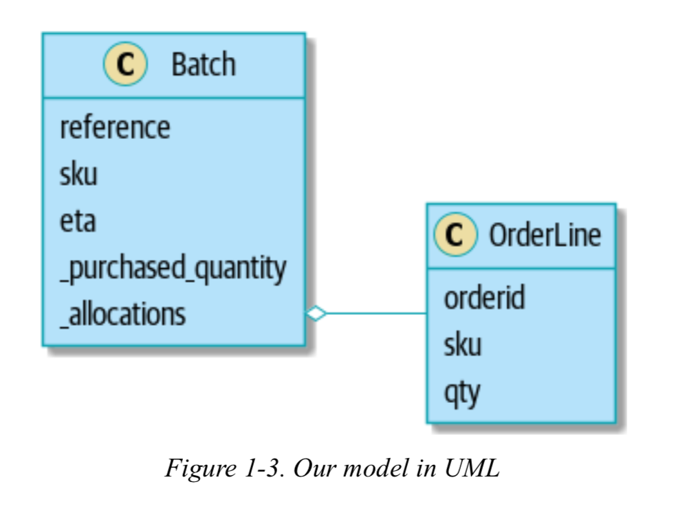

    MORE TYPES FOR MORE TYPE HINTS
    If you really want to go to town with type hints, you could go so far as wrapping primitive types by using typing.NewType:
    Just taking it way too far, Bob

        from dataclasses import dataclass from typing import NewType

        Quantity = NewType("Quantity", int)
        Sku = NewType("Sku", str)
        Reference = NewType("Reference", str)
        ...
        class Batch:
        def __init__(self, ref: Reference, sku: Sku, qty: Quantity):
                self.sku = sku
                self.reference = ref
                self._purchased_quantity = qty

    That would allow our type checker to make sure that we don’t pass a Sku where a Reference is expected, for example.
    Whether you think this is wonderful or appalling is a matter of debate

    Dataclasses Are Great for Value Objects
    We’ve used line liberally in the previous code listings, but what is a line? In our business language, an order has multiple line items,
    where each line has a SKU and a quantity. We can imagine that a simple YAML file containing order information might look like this:

    Order_reference: 12345
    Lines:
        - sku: RED-CHAIR
          qty: 25
        - sku: BLU-CHAIR
          qty: 25
        - sku: GRN-CHAIR
          qty: 25

    Notice that while an order has a reference that uniquely identifies it, a line does not. (Even if we add the order reference to the OrderLine class, it’s not something that uniquely identifies the line itself.)
    Whenever we have a business concept that has data but no identity, we often choose to represent it using the Value Object pattern. A value object is any domain object that is uniquely identified by the data it holds;
    we usually make them immutable:

    OrderLine is a value object

    @dataclass(frozen=True)
    class OrderLine:
        orderid: OrderReference
        sku: ProductReference
        qty: Quantity

    In fact, it’s common to support operations on values; for example, mathematical operators:
    Math with value objects

    fiver = Money('gbp', 5)
    tenner = Money('gbp', 10)

    def can_add_money_values_for_the_same_currency():
        assert fiver + fiver == tenner

    def can_subtract_money_values():
        assert tenner - fiver == fiver

    def adding_different_currencies_fails():
        with pytest.raises(ValueError):
            Money('usd', 10) + Money('gbp', 10)

    def can_multiply_money_by_a_number():
        assert fiver * 5 == Money('gbp', 25)

    def multiplying_two_money_values_is_an_error():
        with pytest.raises(TypeError):
            tenner * fiver

    Value Objects and Entities

    An order line is uniquely identified by its order ID, SKU, and quantity; if we change one of those values, we now have a new line.
    That’s the definition of a value object: any object that is identified only by its data and doesn’t have a long-lived identity.
    What about a batch, though? That is identified by a reference.

    For value objects, the hash should be based on all the value attributes, and we should ensure that the objects are immutable. We get this
    for free by specifying @frozen=True on the dataclass.

    For entities, the simplest option is to say that the hash is None, meaning that the object is not hashable and cannot, for example, be
    used in a set. If for some reason you decide you really do want to use set or dict operations with entities, the hash should be based on the
    attribute(s), such as .reference, that defines the entity’s unique identity over time. You should also try to somehow make that attribute read-only.

    :WARNING: !!
    This is tricky territory; you shouldn’t modify __hash__ without also modifying __eq__. If you’re not sure what you’re doing,

    + run all tests :

    $ pytest --tb=short

+ our final model diagram using DDD :

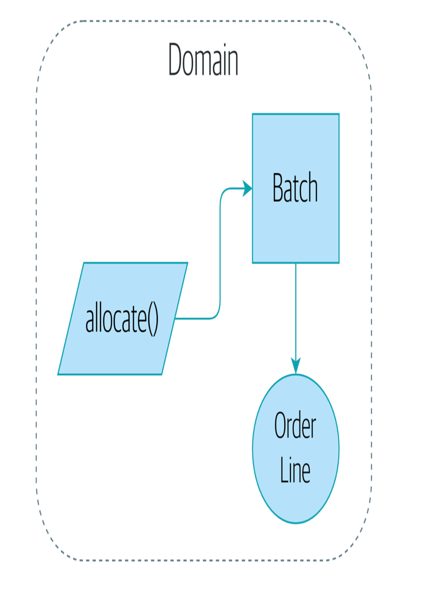

    + Chapter 2. Repository Pattern

    It’s time to make good on our promise to use the dependency inversion principle as a way of decoupling our core logic from infrastructural concerns.
    We’ll introduce the Repository pattern, a simplifying abstraction over data storage, allowing us to decouple our model layer from the data layer.

    Figure 2-1 shows a little preview of what we’re going to build: a Repository object that sits between our domain model and the database.

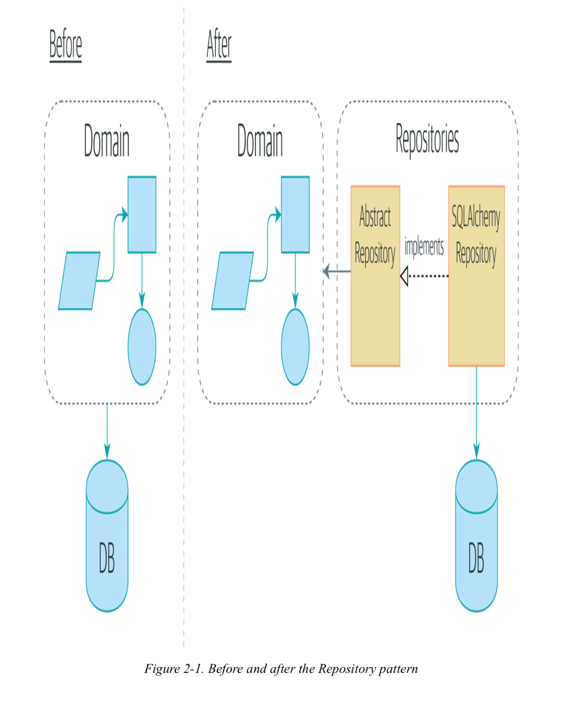

    Applying the DIP (Depandency Inversion principle) to Data Access :

    an allocation is the concept of linking an OrderLine to a Batch. We’re storing the allocations as a collection on our Batch object.

    The most important thing an ORM gives us is persistence ignorance: the idea that our fancy domain model doesn’t need to know anything
    about how data is loaded or persisted. This helps keep our domain clean of direct dependencies on particular database technologies.3
    But if you follow the typical SQLAlchemy tutorial, you’ll end up with something like this:
    SQLAlchemy “declarative” syntax, model depends on ORM (orm.py)

        from sqlalchemy import Column, ForeignKey, Integer, String from sqlalchemy.ext.declarative import declarative_base from sqlalchemy.orm import relationship
        Base = declarative_base()

        class Order(Base):
            id = Column(Integer, primary_key=True)

        class OrderLine(Base):
        id = Column(Integer, primary_key=True)
        sku = Column(String(250))
        qty = Integer(String(250))
        order_id = Column(Integer, ForeignKey('order.id')) order = relationship(Order)
        class Allocation(Base): ...

    You don’t need to understand SQLAlchemy to see that our pristine model is now full of dependencies on the ORM and is starting
    to look ugly as hell besides. Can we really say this model is ignorant of the database? How can it be separate from storage concerns
    when our model properties are directly coupled to database columns?

    - Dependency Inversion is one of the last principles we are going to look at. The principle states that:

    High-level modules should not depend on low-level modules. Both should depend on abstractions.
    Abstractions should not depend on details. Details should depend on abstractions.

    ++ Apply dependency inversion and the Repository pattern

    Inverting the Dependency: ORM Depends on Model :

    Well, thankfully, that’s not the only way to use SQLAlchemy. The alternative is to define your schema separately,
    and to define an explicit mapper for how to convert between the schema and our domain model, what SQLAlchemy calls a classical mapping:

    Testing Fixture :

    What is a fixture?
    A fixture is a function, which is automatically called by Pytest when the name of the argument (argument of the test function or of the another fixture)
    matches the fixture name. In another words:

    @pytest.fixture
    def fixture1():
       return "foo"

    def test_foo(fixture1):
        assert fixture1 == "foo"

    Fixtures as Function arguments
    Test functions can receive fixture objects by naming them as an input argument. For each argument name, a fixture function with that name provides the fixture object.
    Fixture functions are registered by marking them with @pytest.fixture. Let’s look at a simple self-contained test module containing a fixture and a test function using it:

    1- Example :

        # content of ./test_smtpsimple.py
        import pytest

        @pytest.fixture
        def smtp_connection():
            import smtplib

            return smtplib.SMTP("smtp.gmail.com", 587, timeout=5)

        def test_ehlo(smtp_connection):
            response, msg = smtp_connection.ehlo()
            assert response == 250
            assert 0  # for demo purposes

    + conftest.py: sharing fixture functions
    If during implementing your tests you realize that you want to use a fixture function from multiple test files you can move it to a `conftest.py` file. You don’t need to import the fixture you want
    to use in a test, it automatically gets discovered by pytest. The discovery of fixture functions starts at test classes, then test modules, then conftest.py files and finally builtin and third party plugins.

    + Repository Pattern :

    The Repository pattern is an abstraction over persistent storage. It hides the boring details of data access by pretending that all of our data is in memory.

    Abstract class for orm models to make ops like add, get :

        class AbstractRepository(abc.ABC):
            @abc.abstractmethod
            def add(self, batch: model.Batch):
                raise NotImplementedError

            @abc.abstractmethod
            def get(self, reference) -> model.Batch:
                raise NotImplementedError

    - The Repository pattern is probably one of the easiest choices in the book, though, if you’re already heading down the DDD and dependency inversion route. As far as our code is concerned,
      we’re really just swapping the SQLAlchemy abstraction (session.query(Batch)) for a different one (batches_repo.get) that we designed.

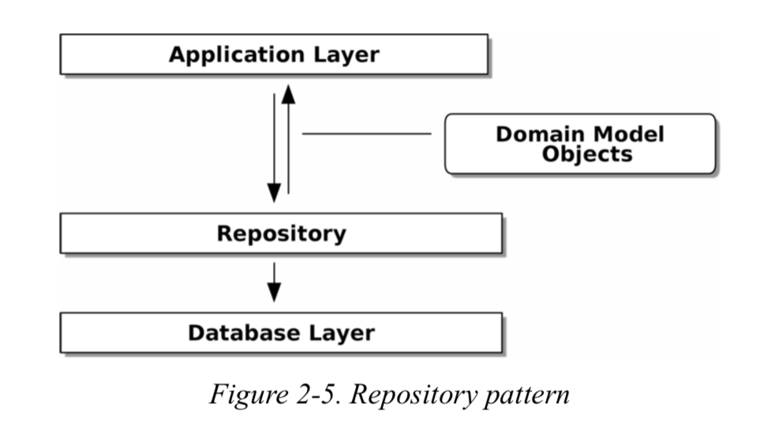

    As always, we start with a test. This would probably be classified as an integration test, since we’re checking that our code (the repository) is correctly integrated with the database; hence,
    the tests tend to mix raw SQL with calls and assertions on our own code.

    What Is a Port and What Is an Adapter, in Python?
    ABC class is the port and SqlAlchemyRepository is the implementation of this abstract class == adpater :
    Now Python doesn’t have interfaces per se, so although it’s usually easy to identify an adapter, defining the port can be harder. If you’re using an abstract base class, that’s the port. If not, the port is just the duck type that your adapters conform to and that your core application expects—the function and method names in use, and their argument names and types.

    NOTE !! : We want to be clear that we’re not saying every single application needs to be built this way; only sometimes does the complexity of the app and domain make it worth investing the time and effort in adding these extra layers of indirection.

Pros and Cons of using Repository Pattern :
Table 2-1. Repository pattern and persistence ignorance: the trade-offs

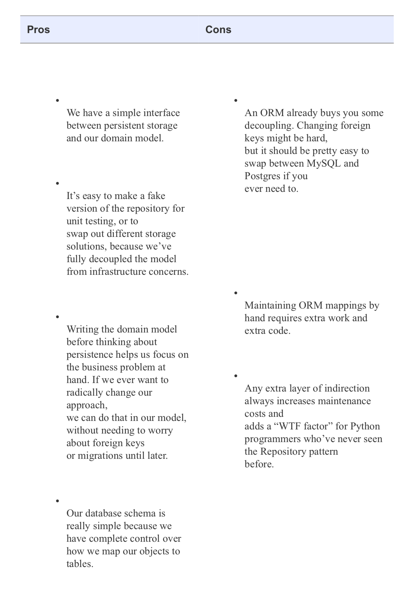

    TIP
    If your app is just a simple CRUD (create-read-update-delete) wrapper around a database, then you don’t need a domain model or a repository.
    But the more complex the domain, the more an investment in freeing yourself from infrastructure concerns will pay off in terms of the ease of making changes.

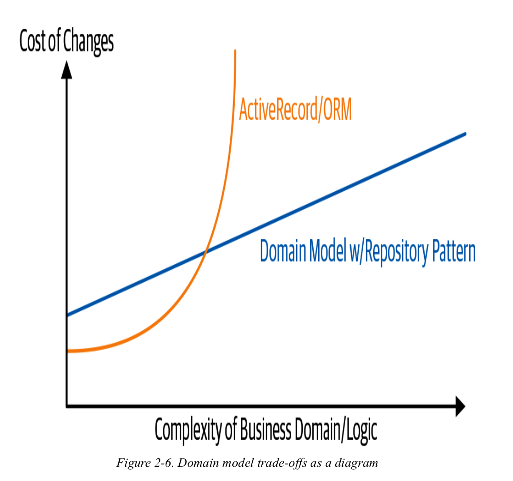

    + chapter 3 - Coupling and Abstractions :

    When we’re unable to change component A for fear of breaking component B, we say that the components have become coupled. Locally, coupling is a good thing: it’s a sign that our
    code is working together, each component supporting the others, all of them fitting in place like the gears of a watch. In jargon, we say this works when there is high cohesion
    between the coupled elements.

    Globally, coupling is a nuisance: it increases the risk and the cost of changing our code, sometimes to the point where we feel unable to make any changes at all. This is the problem
    with the Ball of Mud pattern: as the application grows, if we’re unable to prevent coupling between elements that have no cohesion, that coupling increases superlinearly until we are no
    longer able to effectively change our systems.

- We can reduce the degree of coupling within a system (Figure 3-1) by abstracting away the details (Figure 3-2)..

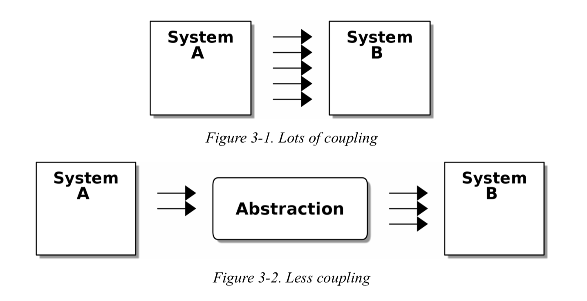

In Figure 3-2, though, we have reduced the degree of coupling by inserting a new, simpler abstraction. Because it is simpler, system A has fewer kinds of dependencies on the abstraction.
The abstraction serves to protect us from change by hiding away the complex details of whatever system B does—we can change the arrows on the right without changing the ones on the left.

    Abstracting State Aids Testability
    Let’s see an example. Imagine we want to write code for synchronizing two file directories, which we’ll call the source and the destination:
    If a file exists in the source but not in the destination, copy the file over.
    If a file exists in the source, but it has a different name than in the destination, rename the destination file to match.
    If a file exists in the destination but not in the source, remove it.

    Our first and third requirements are simple enough: we can just compare two lists of paths. Our second is trickier, though. To detect renames, we’ll have to inspect the content of files.
    For this, we can use a hashing function like MD5 or SHA-1. The code to generate a SHA-1 hash from a file is simple enough:

    - programming approach :

    When we have to tackle a problem from first principles, we usually try to write a simple implementation and then refactor toward better design. We’ll use this approach throughout the book,
    because it’s how we write code in the real world: start with a solution to the smallest part of the problem, and then iteratively make the solution richer and better designed.

    + why not using mock.patch() :

    We have three closely related reasons for our preference:
    Patching out the dependency you’re using makes it possible to unit test the code, but it does nothing to improve the design. Using mock.patch won’t let your code work with a --dry-run flag,
    nor will it help you run against an FTP server. For that, you’ll need to introduce abstractions.
    Tests that use mocks tend to be more coupled to the implementation details of the codebase. That’s because mock tests verify the interactions between things: did we call shutil.copy with the right arguments?
    This coupling between code and test tends to make tests more brittle, in our experience.
    Overuse of mocks leads to complicated test suites that fail to explain the code.

    !! NOTE -> Designing for testability really means designing for extensibility. We trade off a little more complexity for a cleaner design that admits novel use cases.

    MOCKS VERSUS FAKES; CLASSIC-STYLE VERSUS LONDON- SCHOOL TDD
    Here’s a short and somewhat simplistic definition of the difference between mocks and fakes: Mocks are used to verify how something gets used; they have methods like
    assert_called_once_with(). They’re associated with London-school TDD.

    Fakes are working implementations of the thing they’re replacing, but they’re designed for use only in tests. They wouldn’t work “in real life”; our in-memory repository is a good example.
    But you can use them to make assertions about the end state of a system rather than the behaviors along the way, so they’re associated with classic-style TDD.

    - mocks essay -> https://martinfowler.com/articles/mocksArentStubs.html
    - TDD Explained -> http://www.peterprovost.org/blog/2012/05/02/kata-the-only-way-to-learn-tdd/

+ chapter 4 - Flask API and Service Layer :
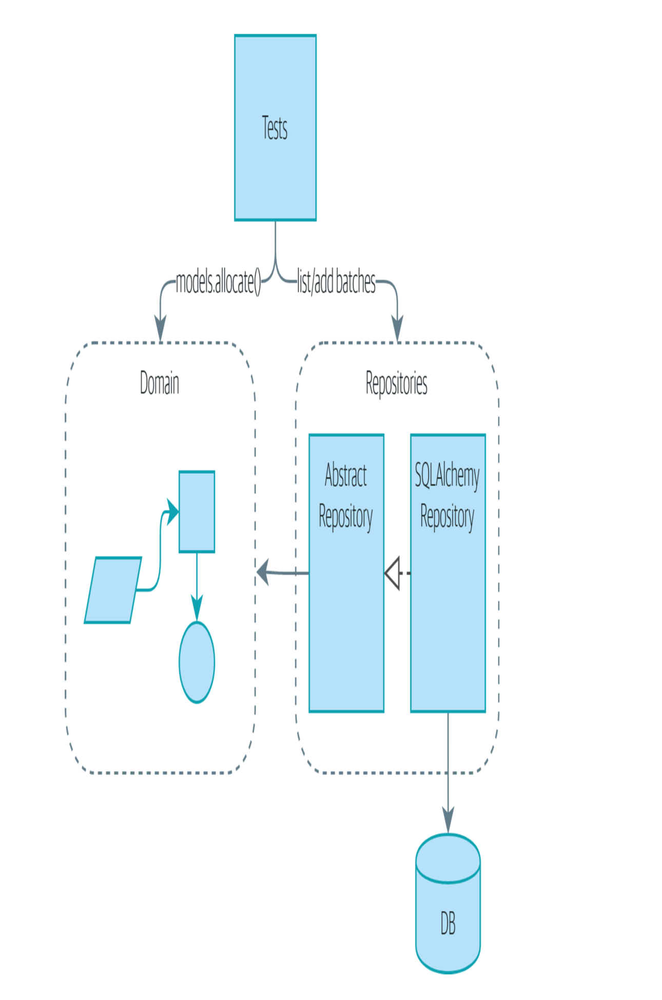

- Figure 4-2 shows what we’re aiming for: we’re going to add a Flask API that will talk to the service layer, which will serve as the entrypoint to our domain model.
  Because our service layer depends on the AbstractRepository, we can unit test it by using FakeRepository but run our production code using SqlAlchemyRepository.

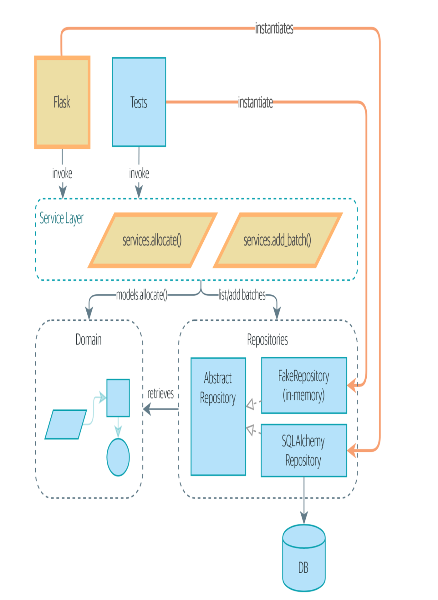

    $ docker container stop $(docker container ls -aq)
    $ docker container rm $(docker container ls -aq)

    !!  DEPEND ON ABSTRACTIONS !!
    Notice one more thing about our service-layer function:

    `def allocate(line: OrderLine, repo: AbstractRepository, session) -> str:`

    It depends on a repository. We’ve chosen to make the dependency explicit, and we’ve used the type hint to say that we depend on AbstractRepository.
    This means it’ll work both when the tests give it a FakeRepository and when the Flask app gives it a SqlAlchemyRepository.

    If you remember “The Dependency Inversion Principle”, this is what we mean when we say we should “depend on abstractions.” Our high-level module,
    the service layer, depends on the repository abstraction. And the details of the implementation for our specific choice of persistent storage also
    depend on that same abstraction. See Figures 4-3 and 4-4.

    If you would like to see print statements as they are executed, you can pass the -s flag to py.test. However, note that this can sometimes be difficult to parse.
    >>> pytest test_api.py -s

    We’ve successfully split our tests into two broad categories: tests about web stuff, which we implement end to end; and tests about orchestration stuff, which we can test against the service layer in memory.

    Putting Things in Folders to See Where It All Belongs
    As our application gets bigger, we’ll need to keep tidying our directory structure.

    Some subfolders
    .
    ├── config.py
    ├── domain
    │   ├── __init__.py
    │   └── model.py
    ├── service_layer
    │   ├── __init__.py
    │   └── services.py
    ├── adapters
    │   ├── __init__.py
    │   ├── orm.py
    │   └── repository.py
    ├── entrypoints
    │   ├── __init__.py
    │   └── flask_app.py
    └── tests
        ├── __init__.py
        ├── conftest.py
        ├── unit
        │   ├── test_allocate.py
        │   ├── test_batches.py
        │   └── test_services.py
        ├── integration
        │   ├── test_orm.py
        │   └── test_repository.py
        └── e2e
            └── test_api.py

Table 4-1. Service layer: the trade-offs

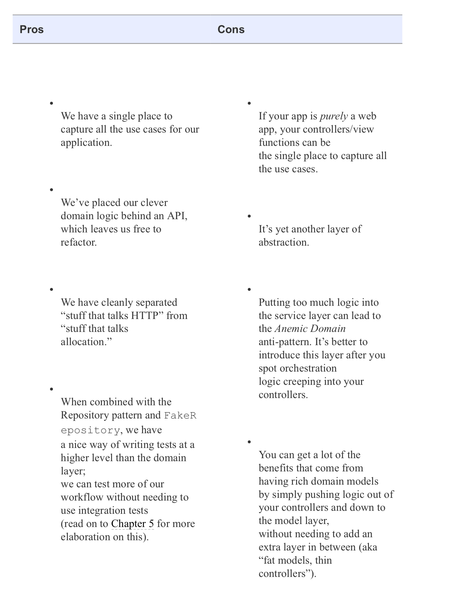

    - How Is Our Test Pyramid Looking?
    -> Not bad! We have 15 unit tests, 8 integration tests, and just 2 end-to- end tests. That’s already a healthy-looking test pyramid.

+ Should Domain Layer Tests Move to the Service Layer?

    - Raison :

    Tests are supposed to help us change our system fearlessly, but often we see teams writing too many tests against their domain model. This causes problems when they come to change their codebase and find that they need to update tens or even hundreds of unit tests.
    As we get further into the book, you’ll see how the service layer forms an API for our system that we can drive in multiple ways. Testing against this API reduces the amount of code that we need to change when we refactor our domain model.
    If we restrict ourselves to testing only against the service layer, we won’t have any tests that directly interact with “private” methods or attributes on our model objects, which leaves us freer to refactor them.

+ TIP -> Every line of code that we put in a test is like a blob of glue, holding the system in a particular shape. The more low-level tests we have, the harder it will be to change things.

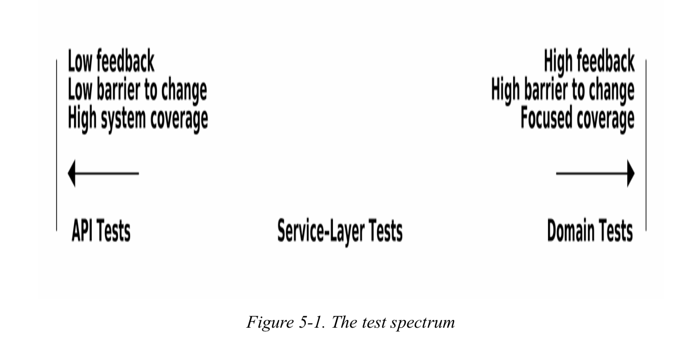

    High and Low Gear
    Most of the time, when we are adding a new feature or fixing a bug, we don’t need to make extensive changes to the domain model. In these cases, we prefer to write tests against services because of the lower coupling and higher coverage.

    Maintain a small core of tests written against your domain model
    These tests have highly focused coverage and are more brittle, but they have the highest feedback. Don’t be afraid to delete these tests if the functionality is later covered by tests at the service layer.

    + Chapter 6. Unit of Work Pattern :

    If the Repository pattern is our abstraction over the idea of persistent storage, the Unit of Work (UoW) pattern is our abstraction over the idea of atomic operations. It will allow us to finally and fully decouple our service layer from the data layer.

+ Figure 6-2 shows our target state. The Flask API now does only two things: it initializes a unit of work, and it invokes a service. The service collaborates with the UoW (we like to think of the UoW as being part of the service layer), but neither the service function itself nor Flask now needs to talk directly to the database.
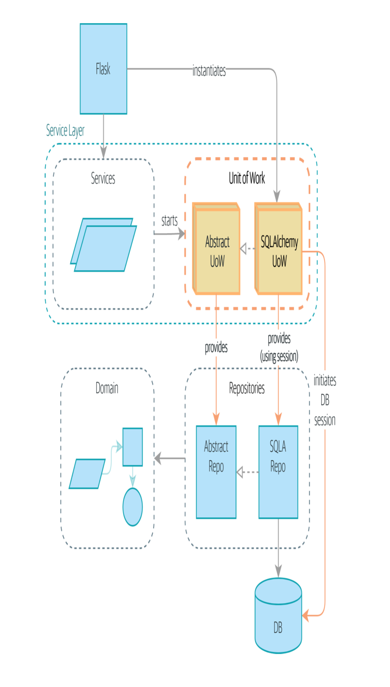

    + The Unit of Work Collaborates with the Repository
    UoW will act as a context manager.
    uow.batches is the batches repo, so the UoW provides us access to our permanent storage.
    When we’re done, we commit or roll back our work, using the UoW.

    The UoW acts as a single entrypoint to our persistent storage, and it keeps track of what objects were loaded and of the latest state
    + This gives us three useful things:

    1- A stable snapshot of the database to work with, so the objects we use aren’t changing halfway through an operation
    2- A way to persist all of our changes at once, so if something goes wrong, we don’t end up in an inconsistent state
    3- A simple API to our persistence concerns and a handy place to get a repository

    Deleting tests :
    You should always feel free to throw away tests if you think they’re not going to add value longer term. We’d say that test_orm.py was primarily a tool to help us learn SQLAlchemy, so we won’t
    need that long term, especially if the main things it’s doing are covered in test_repository.py. That last test, you might keep around,
    but we could certainly see an argument for just keeping everything at the highest possible level of abstraction (just as we did for the unit tests).

Every time you load a new entity from the database, the session begins to track changes to the entity, and when the session is flushed, all your changes are persisted together. Why do we go to the effort
of abstracting away the SQLAlchemy session if it already implements the pattern we want?

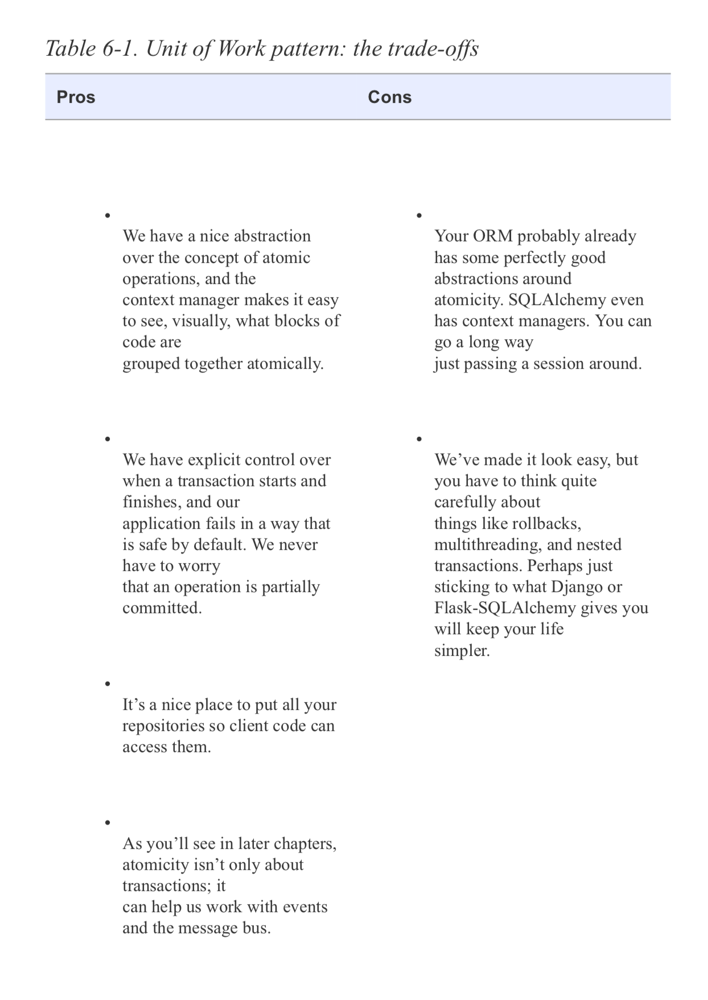

    + UNIT OF WORK PATTERN RECAP :

    - The Unit of Work pattern is an abstraction around data integrity
    It helps to enforce the consistency of our domain model, and improves performance, by letting us perform a single flush operation at the end of an operation.

    - It works closely with the Repository and Service Layer patterns
    The Unit of Work pattern completes our abstractions over data access by representing atomic updates. Each of our service-layer use cases runs in a single unit of work that succeeds or fails as a block.

    - This is a lovely case for a context manager
    Context managers are an idiomatic way of defining scope in Python. We can use a context manager to automatically roll back our work at the end of a request, which means the system is safe by default.

    - SQLAlchemy already implements this pattern
    We introduce an even simpler abstraction over the SQLAlchemy Session object in order to “narrow” the interface between the ORM and our code. This helps to keep us loosely coupled.

